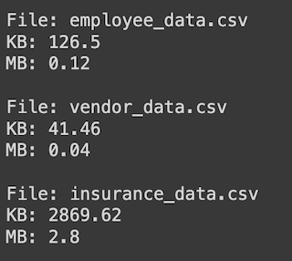
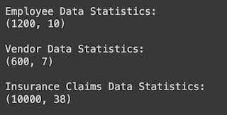
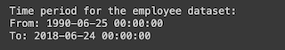
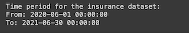
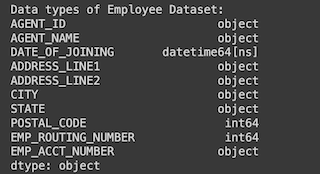
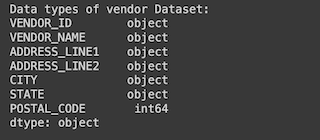
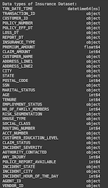

 ## 1. Insurance fraud detection and analysis
- Insurance fraud detection and analysis
- Prepared for UMBC Data Science Master Degree Capstone by Lokesh Chava under the guidance of Dr Chaojie (Jay) Wang
- Author Name: Lokesh Chava
- GitHub profile : https://github.com/lokeshchava
- LinkedIn profile : https://www.linkedin.com/in/chavalokesh
- PowerPoint presentation file : https://docs.google.com/presentation/d/1K-_GsqiDmS10ktd7dYoX4rYIWv3ppP3L7I3vTkyYeag/edit?usp=sharing
    
## 2. Background
Insurance Frauds bangs upto millions of dollars every year for insurance companies. it is very essential to have a fraud dectection system in place to avoid fradulent claims and maintain fairness in the claim process, thus enhancing companies reputation and build trust.
- What is it about?  
  A fraud detection system for insurance claim helps in identifing fraudulent request for insurance claim and helps in improving a very robust and autonomus system.  
- Why does it matter?  
  Fraudulent claims introduce additional risk to insurance portfolios. By detecting and preventing fraud, insurance companies can better manage their risk exposure and maintain the financial health of the organization.  
- What are your research questions?  
  How to classify the fair and fraud requests
  what are the factors that determines fraud activites
  which algorithm best suits the model
## 3. Data 

Describe the datasets you are using to answer your research questions.

- Data sources: [Kaggle Link](https://www.kaggle.com/datasets/mastmustu/insurance-claims-fraud-data?select=vendor_data.csv)
- Data size (MB, GB, etc.)  
  
- Data shape (# of rows and # columns)  
  
- Time period (for example, 2010 to 2020) if your data are time-bound
  - Employee Dataset timeperiod  
    
  - Insurance Dataset Timeperiod  
    
- **What does each row represent?(a patient, a school, a crime, etc.)**
  
- Data dictionary
  - Employee Dataset Columns:  
    
  - Vendor Dataset Columns:  
    
  - Insurance Dataset Columns:  
    
    
- variable used as target/label in ML model
  - Claim Level Fraud Detection:
    - Target Variable: CLAIM_STATUS and CLAIM_AMOUNT. These could indicate whether a claim is fraudulent or not.  
  
- columns selected as features/predictors for your ML models
  - Claim Level Fraud Detection:
    - Features can include various attributes related to the claim, customer, and incident:
      - Customer demographics (AGE, MARITAL_STATUS, SOCIAL_CLASS, etc.).
      - Claim details (CLAIM_AMOUNT, INCIDENT_SEVERITY, INCIDENT_STATE, etc.).
      - Transaction details (TXN_DATE_TIME, POLICY_EFF_DT, REPORT_DT, etc.).

- Future research direction  
  - **Advanced Anomaly Detection Techniques**:
    Explore more sophisticated anomaly detection algorithms like Isolation Forests, Autoencoders, or One-Class SVMs to improve detection accuracy.
  - **Network Analysis**:
    Investigate techniques from network analysis to identify complex collusion patterns involving multiple entities (employees, vendors, customers).
  - **Behavioral Analysis**:
    Develop models that incorporate behavioral analysis techniques to detect subtle changes in employee or vendor behavior that may indicate fraudulent activity.
  - **Real-Time Monitoring**:
    Design systems for real-time monitoring of insurance transactions to enable proactive fraud detection and prevention.
