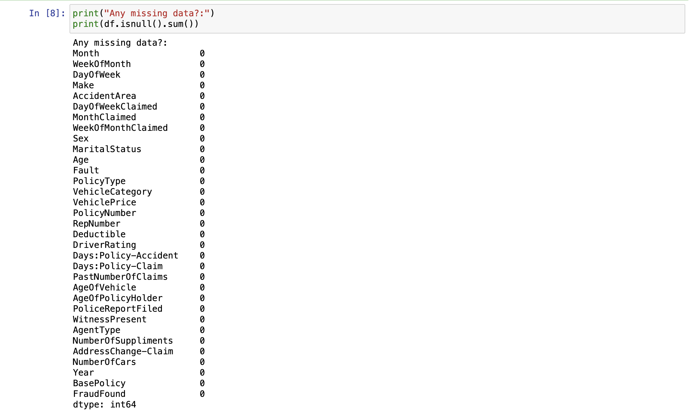
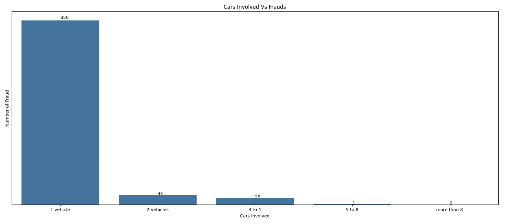
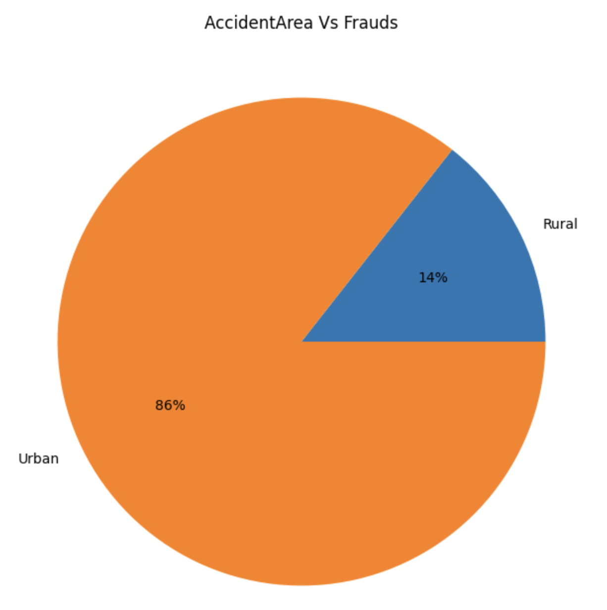
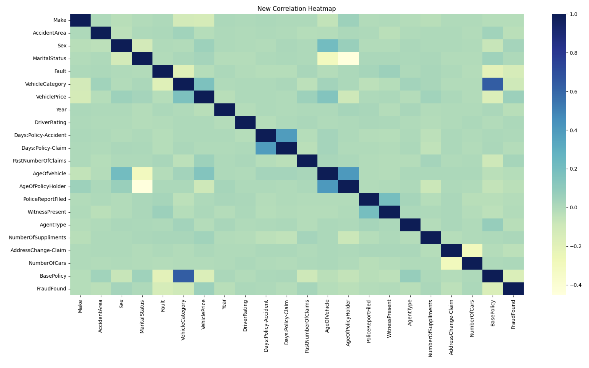
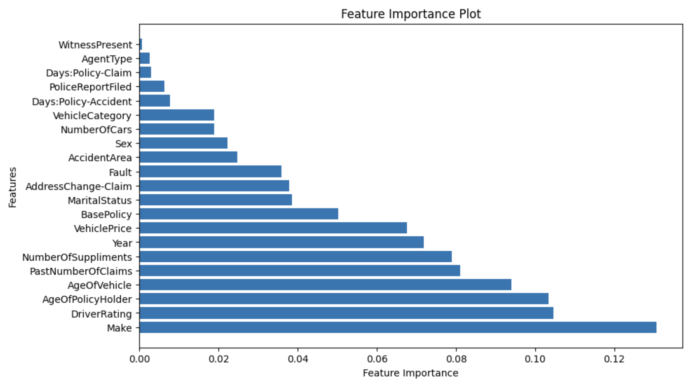
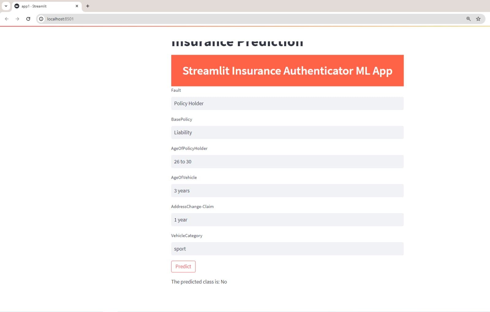

 # Vehicle insurance fraud detection and analysis
- Vehicle insurance fraud detection and analysis
- Prepared for UMBC Data Science Master Degree Capstone by Lokesh Chava under the guidance of Dr Chaojie (Jay) Wang
- Author Name: Lokesh Chava
- GitHub profile: https://github.com/lokeshchava
- LinkedIn profile: https://www.linkedin.com/in/chavalokesh
- PowerPoint presentation file: https://docs.google.com/presentation/d/1K-_GsqiDmS10ktd7dYoX4rYIWv3ppP3L7I3vTkyYeag/edit?usp=sharing
    
# 1. Background
Insurance Fraud bumps up to millions of dollars every year for insurance companies. it is very essential to have a fraud detection system in place to avoid fraudulent claims and maintain fairness in the claim process, thus enhancing the company's reputation and building trust.
- **What is it about?**  
  A fraud detection system for Vehicle insurance claims helps in identifying fraudulent requests for insurance claims and helps in improving a very robust and autonomous system.  
- **Why does it matter?**  
  Fraudulent claims introduce additional risk to insurance portfolios. By detecting and preventing fraud, insurance companies can better manage their risk exposure and maintain the financial health of the organization.  
- **What are your research questions?**  
  How to classify the fair and fraud requests?   
  what are the factors that determine fraud activities?  
  which algorithm best suits the model?  
# 2. Data 

Describe the datasets you are using to answer your research questions.

- Data sources: [Kaggle Link](https://www.kaggle.com/datasets/khusheekapoor/vehicle-insurance-fraud-detection)
- Data size: 3.69 MB
- Data shape: 15420 rows, 33 columns
- Data dictionary
   - Integer type columns: WeekOfMonth, WeekOfMonthClaimed, Age, PolicyNumber, RepNumber, Deductible, DriverRating, Year
   - Object type Columns: Month, DayOfWeek, Make, AccidentArea, DayOfWeekClaimed, MonthClaimed, Sex, MaritalStatus, Fault, PolicyType, VehicleCategory, VehiclePrice,
       Days: Policy-Accident, Days: Policy-Claim, PastNumberOfClaims, AgeOfVehicle, AgeOfPolicyHolder, PoliceReportFiled, WitnessPresent, AgentType,
       NumberOfSuppliments, AddressChange-Claim, NumberOfCars, BasePolicy, FraudFound
- variable used as target/label in ML model
  - Claim Level Fraud Detection:
    - Target Variable: FraudFound. These will indicate whether a claim is fraudulent or not.  
  
- Columns selected as features/predictors for your ML models
  - Claim Level Fraud Detection:
    - Features can include various attributes related to the claim, customer, and incident:
      - Customer demographics (AGE, MARITAL_STATUS, SOCIAL_CLASS, etc.).
      - Claim details (CLAIM_AMOUNT, INCIDENT_SEVERITY, INCIDENT_STATE, etc.).
      - Incident details (DayOfWeek, PoliceReportFiled, NumberOfCars, etc.).

# 3. Project Flow
  - Initial data preparation
  - Performing Exploratory Data Analysis
  - Selecting Data Model
  - Hypertuning the model parameters
  - Testing
  - Web Deployment using Streamlit

# 4. Exploratory Data Analysis (EDA)
- Statistics:  
  
- Missing values:  
  
There aren't any missing values associated with the insurance dataset.
- Fraud Types:  
  
Most of the insurance data has valid claims at 94% while the number of fraudulent cases is 6% only, which makes the dataset extremely imbalanced.
- Car Vs Frauds:  
  
For most of the fraudulent claims, we have only one vehicle involved in the incident which leaves the owner himself making it difficult for incident validation.
- Accident Area Vs Fraud:  
  
It's not quite surprising that most of the incidents have happened in urban areas as they are always packed with traffic and it's very easy to bump into an accident.
- Car Make Vs Fraud:  
  
pontiac stands out to be the carmaker for cars that are involved in car accidents as those cars are mostly labeled for lower-end prices with a compromise in some of the safety features like lane detection, auto steering, etc.
- Fault Vs Fraud:  
  
In most of the incidents, the policyholder holds the fault side at 96% clarifying why there are most of the cases involve only one vehicle.
- Gender Vs Fraud:  
  
Most of the fraudulent cases involve men.
- Correlation:  
  
The correlation matrix's top row and its adjacent columns represent the most coherent pair of columns in our dataset that has the best correlation factor.
- New Correlation:  
  
With the help of our old correlation matrix, we have filtered some of the columns for feature selection and model training. We have also made a feature importance plot by which we can streamline the columns for testing and deployment.
- Feature Importance Plot:  
  

- Class Imbalance:

# 5. Model Training:
# 6. Deployment:

# 7. Conclusion:
Summarize your work and its potential application
Point out the limitations of your work
Lessons learned
Talk about future research direction
# 8. References:

  
