 # Vehicle insurance fraud detection and analysis
- Vehicle insurance fraud detection and analysis
- Prepared for UMBC Data Science Master Degree Capstone by Lokesh Chava under the guidance of Dr Chaojie (Jay) Wang
- Author Name: Lokesh Chava
- GitHub profile: https://github.com/lokeshchava
- LinkedIn profile: https://www.linkedin.com/in/chavalokesh
- PowerPoint presentation file: https://1drv.ms/p/s!Akqcb8QudyJ-imA5JsfhVN5M5o2U?e=nqlrip
    
# 1. Background
Insurance Fraud bumps up to millions of dollars every year for insurance companies. it is very essential to have a fraud detection system in place to avoid fraudulent claims and maintain fairness in the claim process, thus enhancing the company's reputation and building trust.
- **What is it about?**  
  A fraud detection system for Vehicle insurance claims helps in identifying fraudulent requests for insurance claims and helps in improving a very robust and autonomous system.  
- **Why does it matter?**  
  Fraudulent claims introduce additional risk to insurance portfolios. By detecting and preventing fraud, insurance companies can better manage their risk exposure and maintain the financial health of the organization.  
- **What are your research questions?**  
  How to classify the fair and fraud requests?   
  what are the factors that determine fraud activities?  
  which algorithm best suits the model?  
# 2. Data 

Describe the datasets you are using to answer your research questions.

- Data sources: [Kaggle Link](https://www.kaggle.com/datasets/khusheekapoor/vehicle-insurance-fraud-detection)
- Data size: 3.69 MB
- Data shape: 15420 rows, 33 columns
- Data dictionary
   - Integer type columns: WeekOfMonth, WeekOfMonthClaimed, Age, PolicyNumber, RepNumber, Deductible, DriverRating, Year
   - Object type Columns: Month, DayOfWeek, Make, AccidentArea, DayOfWeekClaimed, MonthClaimed, Sex, MaritalStatus, Fault, PolicyType, VehicleCategory, VehiclePrice,
       Days: Policy-Accident, Days: Policy-Claim, PastNumberOfClaims, AgeOfVehicle, AgeOfPolicyHolder, PoliceReportFiled, WitnessPresent, AgentType,
       NumberOfSuppliments, AddressChange-Claim, NumberOfCars, BasePolicy, FraudFound
- variable used as target/label in ML model
  - Claim Level Fraud Detection:
    - Target Variable: FraudFound. These will indicate whether a claim is fraudulent or not.  
  
- Columns selected as features/predictors for your ML models
  - Claim Level Fraud Detection:
    - Features can include various attributes related to the claim, customer, and incident:
      - Customer demographics (AGE, MARITAL_STATUS, SOCIAL_CLASS, etc.).
      - Claim details (CLAIM_AMOUNT, INCIDENT_SEVERITY, INCIDENT_STATE, etc.).
      - Incident details (DayOfWeek, PoliceReportFiled, NumberOfCars, etc.).

# 3. Project Flow
  - Initial data preparation
  - Performing Exploratory Data Analysis
  - Selecting Data Model
  - Hypertuning the model parameters
  - Testing
  - Web Deployment using Streamlit

# 4. Exploratory Data Analysis (EDA)
- **Statistics:**  
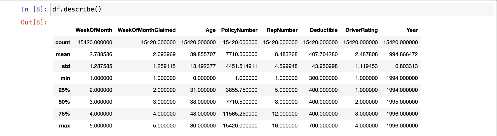  
- **Missing values:**  
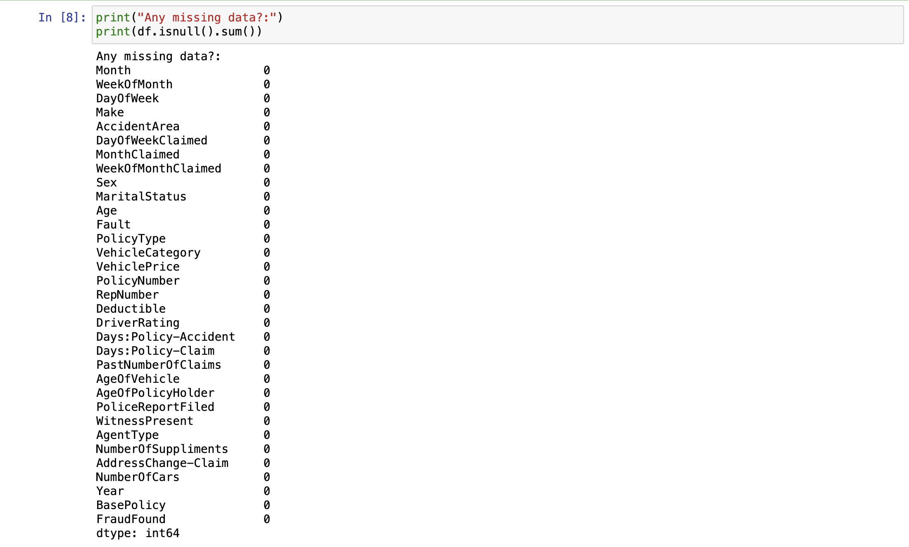  
There aren't any missing values associated with the insurance dataset.  
- **Fraud Types:**  
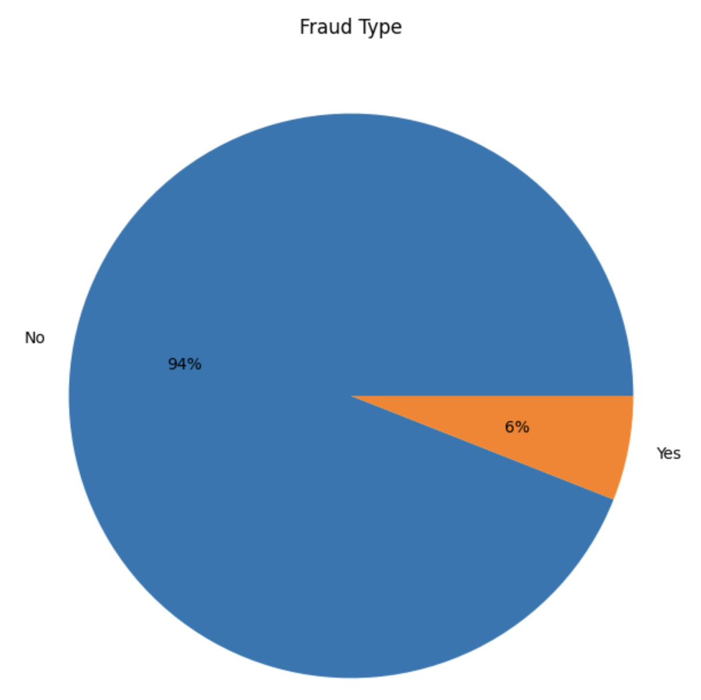  
Most of the insurance data has valid claims at 94% while the number of fraudulent cases is 6% only, which makes the dataset extremely imbalanced.  
- **Car Vs Frauds:** 
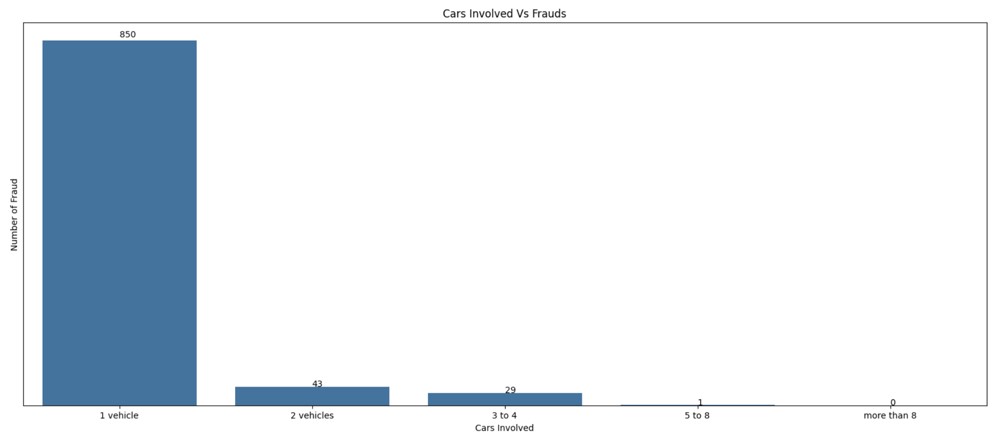  
For most of the fraudulent claims, we have only one vehicle involved in the incident which leaves the owner himself making it difficult for incident validation.  
- **Accident Area Vs Fraud:**  
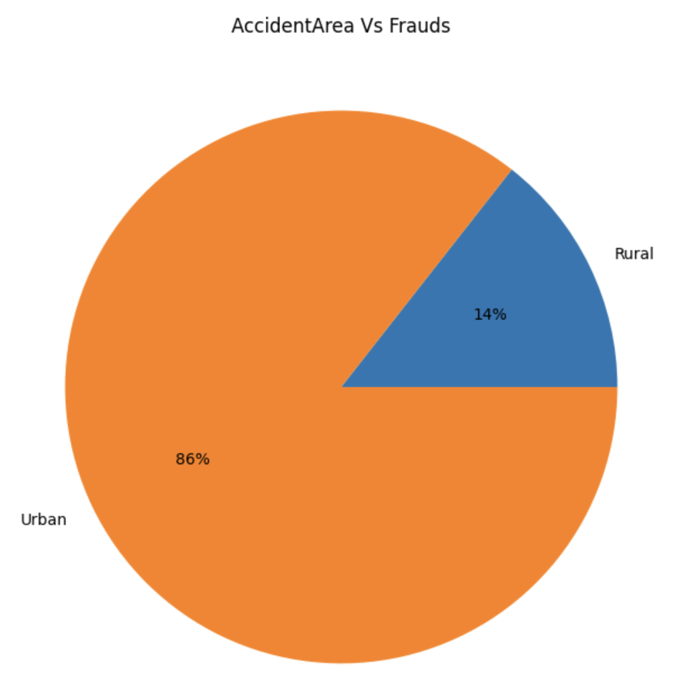  
It's not quite surprising that most of the incidents have happened in urban areas as they are always packed with traffic and it's very easy to bump into an accident.  
- **Car Make Vs Fraud:**  
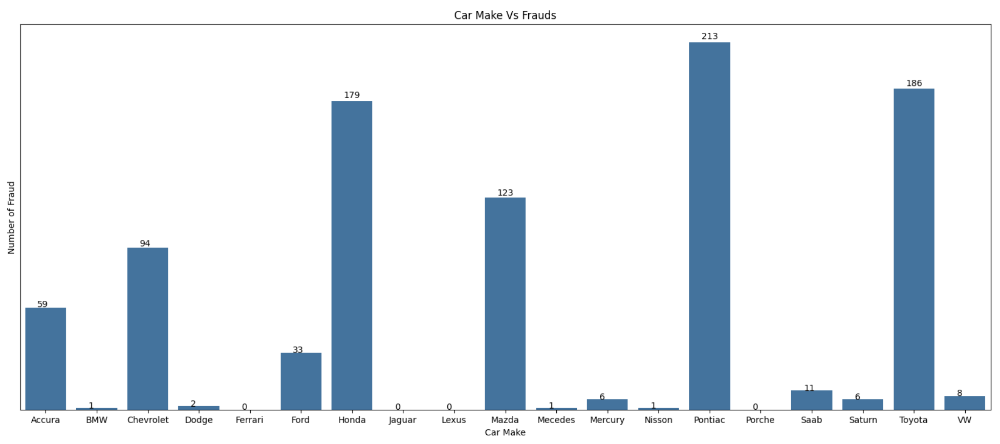  
Pontiac stands out to be the carmaker for cars that are involved in car accidents as those cars are mostly labeled for lower-end prices with a compromise in some of the safety features like lane detection, auto steering, etc.  
- **Fault Vs Fraud:** 
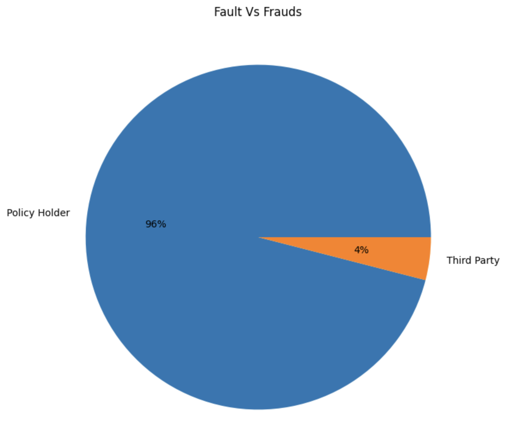  
In most of the incidents, the policyholder holds the fault side at 96% clarifying why there are most of the cases involve only one vehicle.  
- **Gender Vs Fraud:** 
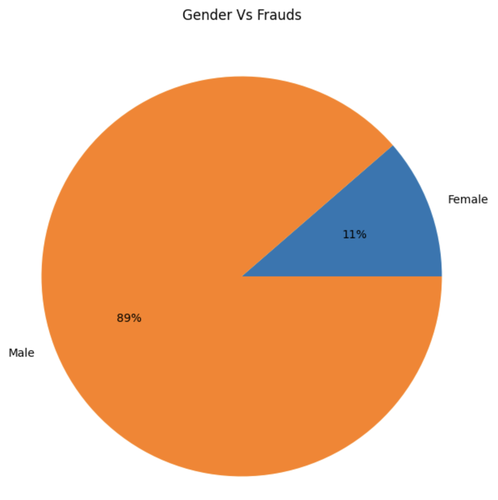  
Most of the fraudulent cases involve men.  
- **Correlation:** 
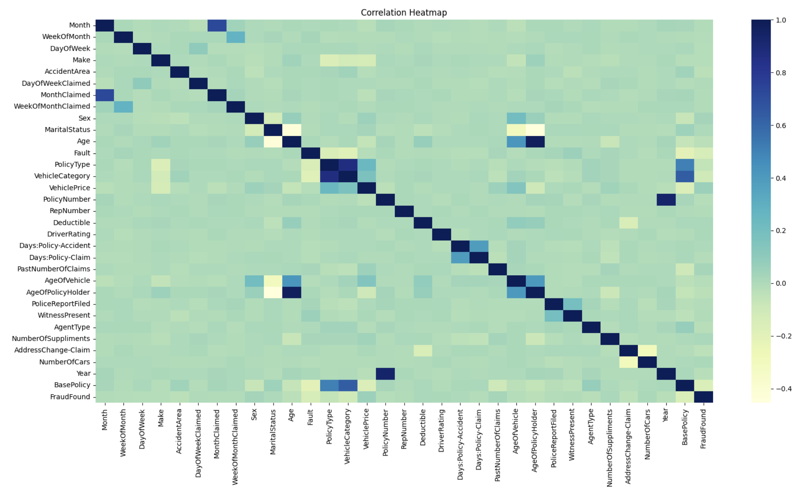  
The correlation matrix's top row and its adjacent columns represent the most coherent pair of columns in our dataset that has the best correlation factor.  
- **New Correlation:** 
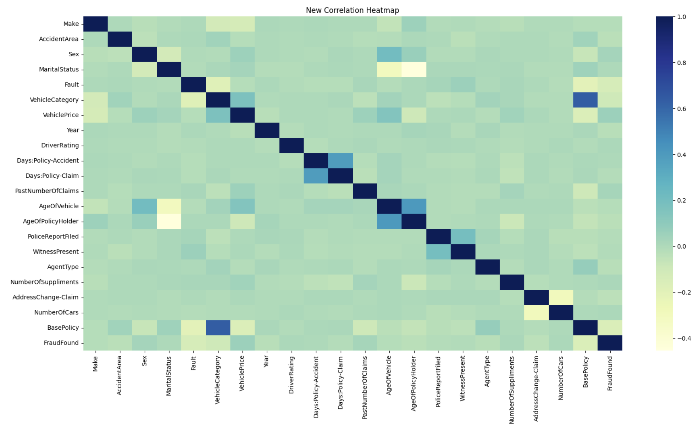  
With the help of our old correlation matrix, we have filtered some of the columns for feature selection and model training. We have also made a feature importance plot by which we can streamline the columns for testing and deployment.  
- **Feature Importance Plot:**  
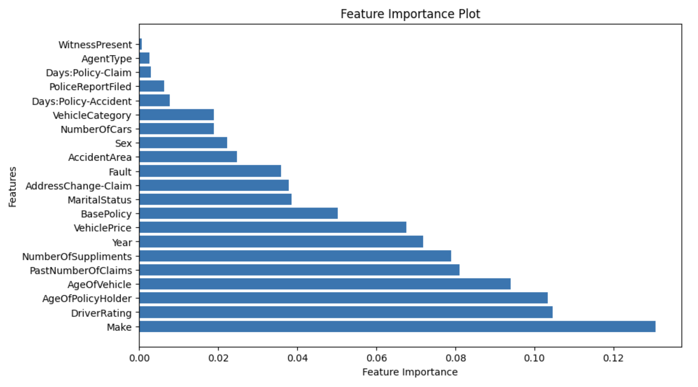  

# 5. Model Training:  
- **Data Preparation:**  
  - Features that are to be used to train the machine learning model are selected using drawing a correlation map between the target variable and other variables. The one with the most correlation has been chosen for feature selection
  - Labels need to be encoded before passing them to a model for training because most machine learning algorithms require numeric inputs for labels rather than categorical or textual ones. Encoding converts labels into a numeric format that the algorithm can understand and process during training. we have used Label Encoder for this job.
  - it is important to split the data into training and testing datasets and by using train_test_split we made separate train and test sets.
  - To balance the classes we have chosen Under-sampling the major class and over-sampling the minor class which reduces class imbalances by adjusting the distribution of samples in each class, making the dataset more balanced. This allows the model to learn from both classes more effectively, leading to better performance in predicting minority class instances.
  - Since we will be working with the cat boost model we have to build feature importance metrics. Feature importance in CatBoost refers to understanding which features have the most influence on the model's predictions. It's important because it helps in interpreting the model's behavior, aids in feature selection, assists in model debugging and provides valuable insights for business decisions
- **Model Building:**

  - **Logistic Regression:**  
     Logistic regression is a statistical model used for binary classification tasks. It estimates the probability of a binary outcome based on one or more predictor variables. It works by fitting a logistic function to the data, which maps the input variables to the output probability.

     We have passed both downsampled and upsampled data separately for our logistic regression model from which we got 75% accuracy from down-sampled data and 73% accuracy from up-sampling the minor class.
    
  - **Random Forest Algorithm:**  
    Random Forest Classifier (RFC) is an ensemble learning method used for classification tasks. It works by constructing multiple decision trees during training and outputs the mode of the classes (classification) or the mean prediction (regression) of the individual trees.
    We have got a 77% accuracy using down-sampling the majority class and 98% accuracy with up-sampling the minor class.

  - **Cat Boost Model:**
    CatBoost is a gradient-boosting algorithm specifically designed to handle categorical variables efficiently. It works by constructing an ensemble of decision trees sequentially, with each tree trained to correct the errors of the previous ones. CatBoost incorporates techniques like ordered boosting, which optimizes the tree construction process, and advanced handling of categorical features, making it effective for a wide range of classification and regression tasks.

    The model accuracy is 84% with a high recall, standing at 81%.
    

# 6. Deployment:

Streamlit is an open-source Python library used to create interactive web applications for machine learning and data science projects. It allows developers to quickly and easily build user interfaces for their machine-learning models using simple Python scripts.  

App HomePage

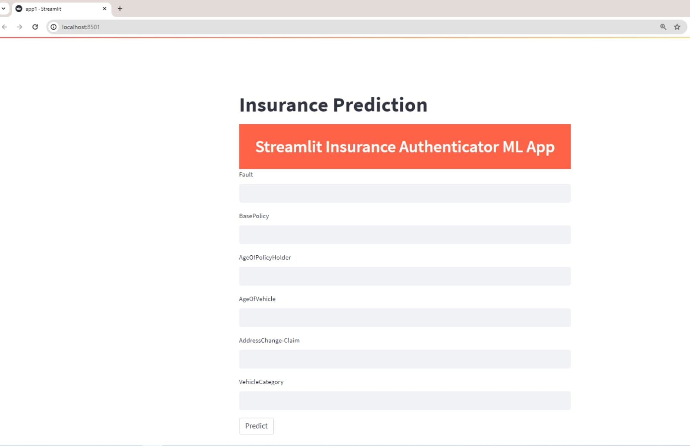  

App Homepage with input and results

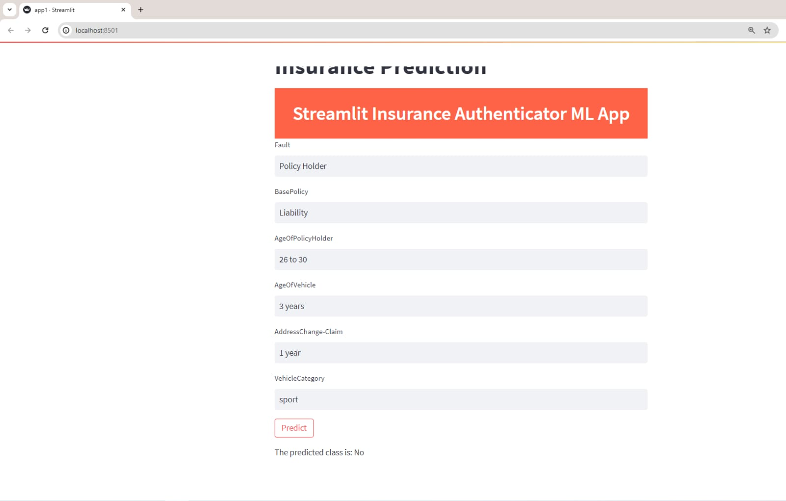  

# 7. Conclusion:
Summarize your work and its potential application
Point out the limitations of your work
Lessons learned
Talk about future research direction
# 8. References:

  
